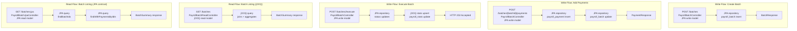

# Flow Diagrams

This diagram summarizes the main demo flows and highlights where JPA or jOOQ is used.

```mermaid
flowchart TD
    subgraph WF1["Write Flow: Create Batch"]
        W1A["POST /batches<br>PayrollBatchController<br>JPA write model"] --> W1B["JPA repository<br>payroll_batch insert"]
        W1B --> W1C["BatchResponse"]
    end

    subgraph WF2["Write Flow: Add Payments"]
        W2A["POST /batches/{batchId}/payments<br>PayrollBatchController<br>JPA write model"] --> W2B["JPA repository<br>payroll_payment insert"]
        W2B --> W2C["JPA repository<br>payroll_batch update"]
        W2C --> W2D["PaymentResponse"]
    end

    subgraph WF3["Write Flow: Execute Batch"]
        W3A["POST /batches/<batchId>/execute<br>PayrollBatchController<br>JPA write model"] --> W3B["JPA repository<br>status updates"]
        W3B --> W3C["jOOQ stats upsert<br>payroll_stats update"]
        W3C --> W3D["HTTP 202 Accepted"]
    end

    subgraph RF1["Read Flow: Batch Listing (jOOQ)"]
        R1A["GET /batches<br>PayrollBatchReadController<br>jOOQ read model"] --> R1B["jOOQ query<br>joins + aggregates"]
        R1B --> R1C["BatchSummary response"]
    end

    subgraph RF2["Read Flow: Batch Listing (JPA contrast)"]
        R2A["GET /batches-jpa<br>PayrollBatchJpaController<br>JPA read model"] --> R2B["JPA query<br>findBatchIds"]
        R2B --> R2C["JPA query<br>findWithPaymentsByIdIn"]
        R2C --> R2D["BatchSummary response"]
    end
```
